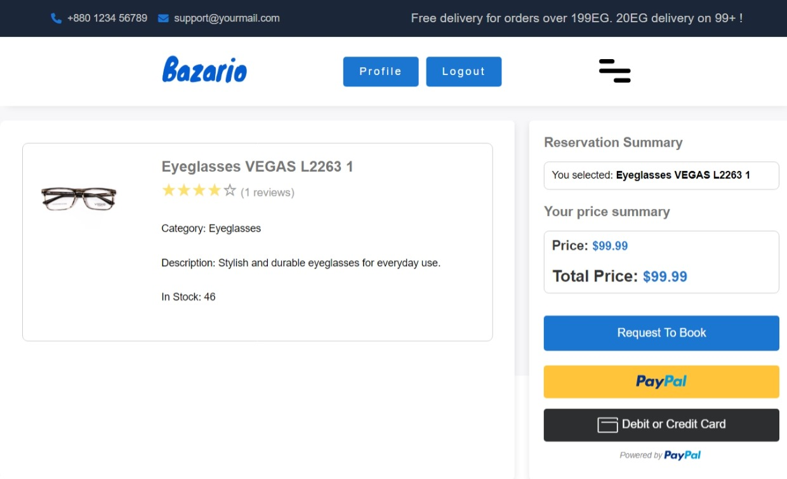

# Bazario Frontend – Eyeglasses E-Commerce Website 🕶️

Bazario is a fully responsive and functional e-commerce frontend for an eyeglasses store. Built entirely with native HTML, CSS, and JavaScript (Vanilla JS), this platform offers a complete user experience with shopping, cart, order tracking, and profile management — connected to a Laravel REST API backend.

## 🔗 Live Demo

- [https://ecommerce-frontend.ershaad.net/](https://ecommerce-frontend.ershaad.net/)
- [https://ziadgamaldev.github.io/bazario-ecommerce-frontend/](https://ziadgamaldev.github.io/bazario-ecommerce-frontend/)

## ✨ Features

### 👤 Customer Side
- Home page with featured products
- Browse all products
- Filter by category, price, and sorting
- Product details page
- Add to wishlist and cart
- Place and track orders
- Profile page with order history
- JWT-based login, registration, and logout

### 🛠️ Admin Panel
- Login authentication
- CRUD for:
  - Categories
  - Products
  - Orders
- Admin dashboard with management panels

## 🔐 Authentication
- JWT-based authentication using localStorage
- Login, register, and logout functionality
- Redirects based on user roles

## 🧪 Seeded Users

**Customer:**
- `customer1@example.com` / `123456`

**Admin:**
- `admin@example.com` / `123456`

## 🛠️ Technologies Used
- HTML5, CSS3
- JavaScript (Vanilla)
- RESTful APIs (Laravel Backend)
- JWT Authentication

## 📁 Project Structure
```
assets/
├── css/
├── js/
│   ├── admin/
│   ├── customer/
│   └── components/
├── images/
pages/
├── admin/
├── auth/
├── customer/
└── components/
```

## 🖼️ Screenshots

[](public/landing-page.png)

[](public/customer-register.jpeg)

[](public/customer-products-list-filter.jpeg)

[](public/customer-product-payment-paypal.jpeg)

[](public/admin-dashboard.jpeg)

[](public/admin-categories-management.jpeg)

## 📌 Project Highlights
- Fully modular structure using includes/partials
- Completely responsive without external frameworks
- Role-based access between admin and customers

## 👥 Contributors

This project was a team collaboration as part of the ITI intake:

- **Ziad Gamal** – Frontend & Backend Integration
- **Ahmed Mostafa**
- **Heba Sabri**
- **Sohaila Abd Elazeem**

## 📚 Related Projects

- 👉 [Backend Repository (Laravel)](https://github.com/ZiadGamalDev/bazario-ecommerce-backend)

## 📝 Note

Bazario was developed during the **Information Technology Institute (ITI)** program, a leading tech education institute in Egypt affiliated with the Ministry of Communications and Information Technology.
